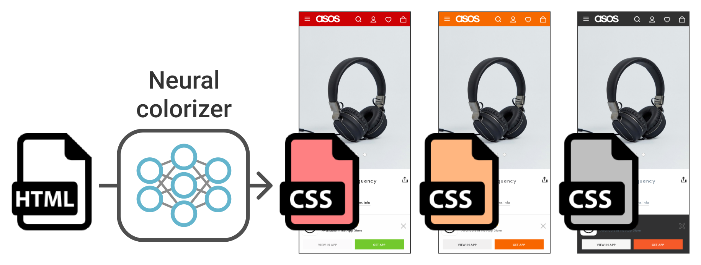

# Generative Colorization of Structured Mobile Web Pages

Official reimplementation of Generative Colorization of Structured Mobile Web Pages, WACV 2023.

[ArXiv](https://arxiv.org/abs/2212.11541) | [Dataset](docs/dataset.md) | [Pre-trained models](docs/pretrained_models.md)

<p align="center">
  </img>
</p>

## Setup

### Development environment

-   Ubuntu 22.04, Python 3.10.9, Poetry 1.2.2
-   CUDA 11.6, cuDNN 8.7.0
-   PyTorch 1.12.1, PyTorch Lightning 1.8.6, Deep Graph Library 0.9.1
-   (For taking screenshots) Google Chrome 108.0.5359.124, ChromeDriver 108.0.5359.71
-   (For computing contrast violations) Lighthouse 9.6.8

### Installation

```bash
git clone https://github.com/CyberAgentAILab/webcolor.git
poetry install
```

Note that we cannot guarantee or support operation in other environments, such
as Windows. If you wish to install PyTorch or DGL for other CUDA versions,
please edit URLs in [pyproject.toml](pyproject.toml). You can find the commands
to install Chrome, ChromeDriver, and Lighthouse on Ubuntu [here](docs/install_chrome.md).

## Data preparation

```bash
./data/download.sh cache
```

For details on the dataset, please see [this document](docs/dataset.md).

## Colorization demo

```bash
MODEL_NAME=CVAE  # {CVAE,NAR,AR,Stats}
BASE_URL=https://storage.googleapis.com/ailab-public/webcolor/checkpoints
poetry run python demo.py --model $MODEL_NAME --ckpt_path ${BASE_URL}/${MODEL_NAME}.ckpt --upsampler_path ${BASE_URL}/Upsampler.ckpt --target random --out_path output/screenshot.png --num_save 3 --save_gt
```

The above command performs automatic colorization using pre-trained models and
produces screenshots like the following.

|CVAE #1|CVAE #2|CVAE #3|Real|
|:---:|:---:|:---:|:---:|
|||||

## Training

```bash
MODEL_NAME=CVAE  # {CVAE,NAR,AR,Stats,Upsampler}
poetry run python -m webcolor.main fit --model $MODEL_NAME --trainer.accelerator gpu --trainer.devices 1
```

Model hyperparameters can be listed with `--model.help $MODEL_NAME`.

## Evaluation

```bash
MODEL_NAME=CVAE  # {CVAE,NAR,AR,Stats,Upsampler}
CKPT_PATH=https://storage.googleapis.com/ailab-public/webcolor/checkpoints/${MODEL_NAME}.ckpt  # Evaluate the pre-trained model
# CKPT_PATH=lightning_logs/version_0/checkpoints/best.ckpt  # Evaluate your own trained model
poetry run python -m webcolor.main test --model $MODEL_NAME --ckpt_path $CKPT_PATH --trainer.default_root_dir /tmp --trainer.accelerator gpu --trainer.devices 1
```

The following command calculates Pixel-FCD and contrast violations and takes a
long time to complete (about three hours with 24 workers in our environment).

```bash
MODEL_NAME=CVAE  # {CVAE,NAR,AR,Stats}
CKPT_PATH=https://storage.googleapis.com/ailab-public/webcolor/checkpoints/${MODEL_NAME}.ckpt
# CKPT_PATH=lightning_logs/version_0/checkpoints/best.ckpt
UPSAMPLER_PATH=https://storage.googleapis.com/ailab-public/webcolor/checkpoints/Upsampler.ckpt
# UPSAMPLER_PATH=lightning_logs/version_1/checkpoints/best.ckpt
poetry run python eval.py --num_workers 4 --model $MODEL_NAME --ckpt_path $CKPT_PATH --upsampler_path $UPSAMPLER_PATH
```

For details on the pre-trained models, please see [this document](docs/pretrained_models.md).

## Citation

```bibtex
@inproceedings{Kikuchi2023,
    title = {Generative Colorization of Structured Mobile Web Pages},
    author = {Kotaro Kikuchi and Naoto Inoue and Mayu Otani and Edgar Simo-Serra and Kota Yamaguchi},
    booktitle = {IEEE/CVF Winter Conference on Applications of Computer Vision (WACV)},
    year = {2023},
    pages = {3650-3659},
    doi = {}
}
```

## Licence

The code is licensed under Apache-2.0 and the dataset is licensed under CC BY-NC-SA 4.0.
