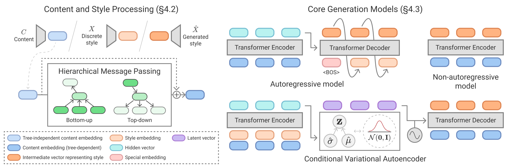

# Pre-trained models

</img>

The following table summarizes the performance of the pre-trained models and the
URLs of checkpoints and configurations. The scores are slightly different from
the paper due to refactoring of the code, but the trends are generally the same.
We set `--seed_everything 0` for both training and evaluation. The training logs
can be found at
[TensorBoard.dev](https://tensorboard.dev/experiment/FQPauprTR5Clxgp6kdjNLQ/).

Name|Accuracy (RGB)|Accuracy (Alpha)|F-score (RGB)|F-score (Alpha)|URL|Note
---|---|---|---|---|---|---
Stats (mode)|0.717|0.891|0.003|0.219|[ckpt](https://storage.googleapis.com/ailab-public/webcolor/checkpoints/Stats.ckpt), [config](https://storage.googleapis.com/ailab-public/webcolor/configs/Stats.yaml)|Evaluate with ``--model.sampling false``.
Stats (sampling)|0.620|0.821|0.004|0.206|[ckpt](https://storage.googleapis.com/ailab-public/webcolor/checkpoints/Stats.ckpt), [config](https://storage.googleapis.com/ailab-public/webcolor/configs/Stats.yaml)|Evaluate with ``--model.sampling true``.
AR (greedy)|0.758|0.916|0.064|0.612|[ckpt](https://storage.googleapis.com/ailab-public/webcolor/checkpoints/AR.ckpt), [config](https://storage.googleapis.com/ailab-public/webcolor/configs/AR.yaml)|Evaluate with ``--model.top_p 0.0``.
AR (top-p, p=0.8)|0.755|0.915|0.062|0.605|[ckpt](https://storage.googleapis.com/ailab-public/webcolor/checkpoints/AR.ckpt), [config](https://storage.googleapis.com/ailab-public/webcolor/configs/AR.yaml)|Evaluate with ``--model.top_p 0.8``.
AR (top-p, p=0.9)|0.753|0.914|0.061|0.604|[ckpt](https://storage.googleapis.com/ailab-public/webcolor/checkpoints/AR.ckpt), [config](https://storage.googleapis.com/ailab-public/webcolor/configs/AR.yaml)|Evaluate with ``--model.top_p 0.9``.
NAR|0.774|0.929|0.078|0.677|[ckpt](https://storage.googleapis.com/ailab-public/webcolor/checkpoints/NAR.ckpt), [config](https://storage.googleapis.com/ailab-public/webcolor/configs/NAR.yaml)|
CVAE|0.773|0.929|0.069|0.663|[ckpt](https://storage.googleapis.com/ailab-public/webcolor/checkpoints/CVAE.ckpt), [config](https://storage.googleapis.com/ailab-public/webcolor/configs/CVAE.yaml)|
Upsampler|-|-|-|-|[ckpt](https://storage.googleapis.com/ailab-public/webcolor/checkpoints/Upsampler.ckpt), [config](https://storage.googleapis.com/ailab-public/webcolor/configs/Upsampler.yaml)|Used together with all the other models.
